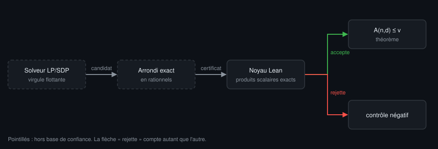

# delsarte

Formalisation en **Lean 4** du socle du programme linéaire de Delsarte, et des
certificats qui en découlent.

## À quoi ça sert

**Le problème, sans jargon.** Vous envoyez des bits sur un canal qui en abîme
quelques-uns au passage. Pour survivre au bruit, on n'utilise pas tous les mots
possibles : on n'en garde qu'une partie, choisis assez éloignés les uns des
autres pour qu'une poignée d'erreurs ne puisse jamais transformer un mot en un
autre. Plus les mots sont écartés, plus on corrige d'erreurs — mais moins il en
reste, donc moins on transmet d'information par envoi.

`A(n,d)` est le chiffre exact de ce compromis : combien de mots de `n` bits
peut-on retenir au maximum, si deux quelconques d'entre eux doivent différer en
au moins `d` positions. C'est un problème d'empilement — des boules qui ne
doivent pas se chevaucher, dans un cube de dimension `n`.

```
n = 19 — combien de mots de 19 bits peut-on garder ?

  d = 1     524 288 mots   (2^19, tous)      aucune correction
  d = 4   ≤  13 106        certifié          corrige 1 erreur
  d = 6   ≤   1 280        sous hypothèse    corrige 2 erreurs
  d = 19          2 mots                     correction maximale

  Le prix n'est pas régulier : ×40 d'un cran au suivant, puis ×10.
  13 106 est démontré ici sans hypothèse. 1 280 ne l'est que sous
  une hypothèse non prouvée (#44, #45) — voir plus bas.
```

Pour voir de quoi il s'agit, un cas assez petit pour tenir dans une image — et
le seul que ce dépôt épingle des deux côtés :

![Le code de Hamming étendu [8,4,4] dans le cube de dimension 8](figures/hamming8.svg)

`n = 8`, `d = 4`. Les 256 cases sont les mots de 8 bits ; deux cases voisines à
l'écran sont à distance 1 (la réciproque est fausse : sur les 8 voisins d'un
mot, 4 seulement sont adjacents dans cette disposition). Les 16 cases vives
forment le code de Hamming étendu, et autour de chacune sa boule de rayon 1.
Aucune boule n'en recouvre une autre, et il reste 112 cases libres — pourtant
aucun 17ᵉ mot ne tient : les deux cases cerclées sont à distance 2, il en
faudrait 4. Ce n'est pas la place qui manque.

`A(8,4) = 16` est démontré ici dans les deux sens — borne haute par certificat
LP (`A_8_2_4_le`), borne basse par la matrice génératrice (`A_8_2_4_ge`),
recollées par `le_antisymm` en `A_8_2_4_eq`. La figure est engendrée par
`tools/figure_hamming8.py`, qui recalcule et vérifie chaque nombre affiché
avant d'écrire le fichier.

La même égalité, vue non plus dans le cube mais dans sa démonstration :



Chaque boîte est un théorème du dépôt, avec son fichier et sa ligne. La racine,
`weak_duality`, est énoncée sur un anneau ordonné quelconque et ne sait rien des
codes : c'est elle qui rend le socle réutilisable. Les deux feuilles encadrées de
vert sont des `by decide` sur des entiers — le seul endroit où quelque chose est
calculé, et le noyau s'en charge. Entre les deux, aucune étape numérique. La
branche gauche descend du certificat, la droite de la matrice génératrice ;
`le_antisymm` les recolle. La figure est engendrée par `tools/figure_proof8.py`,
qui recalcule le certificat en rationnels exacts et vérifie les cinq contraintes
duales avant d'écrire le fichier — ce sont les nombres imprimés en bas.

Personne ne sait calculer `A(n,d)` en général. Même pour `n = 19` et `d = 6`,
la valeur exacte est inconnue : on ne dispose que d'un encadrement, et la
meilleure borne supérieure publiée est 1237.

**Ce qu'apporte une borne supérieure.** Un théorème d'arrêt. Il ne construit
aucun code — il dit qu'au-delà d'un certain nombre de mots, chercher est vain.
Sans lui, on ignore si un code qu'on ne trouve pas est impossible, ou seulement
pas encore trouvé. C'est la différence entre une recherche qui a échoué et une
recherche qui n'avait pas lieu d'être.

**Pourquoi le vérifier par machine.** Ces bornes sortent de solveurs numériques,
en virgule flottante, dont la sortie est rarement rejouée en arithmétique
exacte. Elles entrent dans les tables de référence et y restent, citées telles
quelles pendant des années. Une erreur d'arrondi n'y laisse aucune trace
visible.

Ici le solveur ne fait autorité sur rien. Il propose un candidat ; le noyau de
Lean le recalcule en rationnels exacts, sans jamais voir le programme qui l'a
produit.



En pointillés, ce qui est hors base de confiance. Chercher reste cher, vérifier
devient bon marché — et n'importe qui peut rejouer la vérification sans avoir à
faire confiance à celui qui a fourni le certificat. La flèche « rejette » compte
autant que l'autre : un vérificateur qui n'a jamais rien refusé n'a rien prouvé.

**Ce qui se transporte.** Le schéma — solveur hors base de confiance, certificat
rationnel, vérification par le noyau, contrôles négatifs — ne dépend pas de
Delsarte. Il vaut pour d'autres bornes de combinatoire obtenues par
programmation linéaire ou semi-définie.

## But

Ce dépôt ne vise pas à redémontrer des résultats acquis. Le kissing number en
dimensions 8 et 24 — `240` et `196 560`, établis en 1979 par Odlyzko–Sloane et
Levenshtein — est un **test de charge** du socle, pas la destination. Personne
n'attend cette preuve.

En dimension 24, la formalisation existe déjà : Math, Inc.
([Sphere-Packing-Lean](https://github.com/math-inc/Sphere-Packing-Lean), mars
2026) démontre la borne LP, les 196 560 vecteurs et la norme minimale du réseau.
La preuve d'ici suit une autre route — liste explicite, séparation famille par
famille — et n'apporte aucun résultat neuf.

La cible est le côté *packing* du schéma de Hamming : les entrées **ouvertes**
de la table `A(n,d)`, dont la meilleure borne supérieure connue repose souvent
sur des calculs flottants jamais rejoués. La dualité faible formalisée rend ces
bornes **auditables sans refaire le calcul** : tout vecteur dual réalisable,
même non optimal, donne une borne valide, et la vérifier se réduit à des
produits scalaires rationnels exacts.

C'est le créneau que les quatre formalisations de 2026 laissent vide — flag
algebras sur graphes simples, codes couvrants q-aires, `K₈(4,2)`, et
Sphere-Packing-Lean, qui touche au LP sphérique en dimension 24 : aucune ne
touche au LP de Delsarte sur le schéma de Hamming ni à `A(n,d)`.

### Ce que le LP nu donne sur les entrées ouvertes

Mesuré avant d'être annoncé, par `tools/delsarte_lp.py` — simplexe exact en
`Fraction`, dual re-vérifié à chaque ligne. La colonne « connue » vient de la
table de Brouwer, recoupée contre quatre ancres déjà certifiées ici
(`A(8,4)=16`, `A(12,6)=24`, `A(15,6)=128`, `A(24,8)=4096`) : une première
extraction décalée d'une colonne a été rejetée par ce contrôle.

| n | d | LP de Delsarte | meilleure connue | écart |
|---|---|---|---|---|
| 18 | 4 | 6 553 | 5 632 – **6 552** | **+1** |
| 19 | 4 | 13 107 | 10 496 – **13 104** | +3 |
| 26 | 4 | 1 198 372 | … – **1 198 368** | +4 |
| 27 | 4 | 2 396 745 | … – **2 396 736** | +9 |
| 24 | 6 | 24 107 | 16 384 – **24 106** | **+1** |
| 28 | 6 | 291 271 | 131 072 – **291 269** | +2 |
| 23 | 10 | 151 | 80 – **150** | **+1** |
| **28** | **12** | **288** | 178 – **288** | **0** |

Colonne « connue » relue sur la table de Brouwer le 15 septembre 2026 : inchangée.
Un article de 2023 (SDP sur une algèbre de Terwilliger scindée, *Designs, Codes
and Cryptography*) annonce `A(18,4) ≤ 6551` et `A(19,4) ≤ 13087`, validés en
flottant avec borne d'erreur, sans certificat exact ; la table ne les reprend
pas, ce tableau non plus.

Verdict : **le LP nu ne bat le connu nulle part.** C'était l'issue attendue —
les bornes de table viennent d'un LP *renforcé*, pas du LP brut. Deux faits
exploitables en sortent.

1. `A(28,12) ≤ 288` est la seule entrée ouverte où le LP brut atteint la
   meilleure borne connue.
2. La récurrence `A(n,d) ≤ 2·A(n−1,d)` — partition du code selon un bit fixé,
   raccourcissement — se démontre en Lean et se compose avec les certificats.

### Ce que la composition donne, et ce qu'elle ne donne pas

Une version antérieure de ce paragraphe affirmait que la récurrence « explique »
les valeurs de table, au motif que `2 × 3 276 = 6 552`, `2 × 599 184 = 1 198 368`
et deux autres produits tombent juste. Le calcul est exact et la conclusion
fausse : ces produits partent des bornes *de la table*, meilleures que celles du
LP nu. Partant des bornes certifiées ici, la composition gagne une à deux unités
sur le LP seul, et reste au-dessus de la littérature.

| entrée | LP seul | composé | meilleure connue |
|---|---|---|---|
| `A(19,4)` | 13 107 | **13 106** | 13 104 |
| `A(20,4)` | 26 214 | **26 212** | 26 168 |
| `A(24,4)` | 349 525 | **349 524** | 344 308 |
| `A(27,4)` | 2 396 745 | **2 396 744** | 2 396 736 |
| `A(28,4)` | 4 793 490 | **4 793 488** | 4 792 950 |

Gain d'un à deux mots de code. Il est conservé parce qu'il est *gagné* : deux
étapes certifiées, aucune dépendance au flottant d'un solveur.

### Acquis

`Delsarte/Certificate/Table6.lean` — neuf bornes sur des lignes où la
littérature donne encore un intervalle. **Aucune n'améliore la littérature** :
huit sont plus faibles, d'une unité à cinq cents. `A(28,2,12) ≤ 288` égale la
meilleure borne supérieure connue d'une entrée ouverte — minorant 178 — et c'est
la seule ligne où ce dépôt en dit autant que la littérature sur une entrée non
résolue.

`Table7.lean` et `Table8.lean` en ajoutent vingt-huit, seize de borne au moins
dix — de `A(11,2,6) ≤ 12` à `A(23,2,8) ≤ 2048` — et douze plus petites. Toutes
égalent la borne publiée, **aucune n'améliore quoi que ce soit** : ce ne sont pas
des résultats, c'est de la couverture. Elles manquaient pour une raison sans
rapport avec la difficulté — la liste des bornes était saisie à la main, donc rien
ne signalait leur absence. Ce sont exactement les cellules où l'optimum exact du
programme linéaire est déjà entier ; ce qui reste dehors en est exclu par la
non-intégralité de cet optimum, non par le coût de la vérification.

Le pas manquant n'était pas le LP. L'optimum en `n = 18`, `d = 4` vaut
`32768/5 = 6553,6`, et aucun vecteur dual n'atteint `6553` : c'est
l'**intégralité de `A`** qui conclut. `Delsarte/Certificate/Floor.lean` ajoute la
vérification stricte `borne < B + 1` qui en tient lieu.

Trois contrôles négatifs, décidés par le même noyau : la vérification refuse
`287` pour `A(28,12)`, refuse `6552` pour `A(18,4)`, et rejette un certificat
trafiqué dont le premier coefficient passe de `4389` à `4000`.

### Ce qui n'est pas promis

Fermer une entrée ouverte est improbable : `A(17,6) ∈ [258, 340]` résiste depuis
des décennies, et bien des gens ont essayé. Le résultat réaliste est
l'**auditabilité** d'une borne existante, pas une découverte. Il peut être nul,
et l'étape de mesure ci-dessus est précisément là pour le dire tôt.

Le renforcement SDP de Schrijver (algèbre de Terwilliger), qui bat Delsarte sur
beaucoup d'entrées, explique une partie de l'écart mesuré. Son certificat est
vérifié par le noyau, sa validité comme relaxation ne l'est pas encore (voir
plus bas).

Mesure préalable, par `tools/schrijver_sdp.py` — flottant, hors base de
confiance ; modèle vérifié sur des codes réels, le point `z = λ / |C|` d'un code
réel satisfaisant chaque contrainte :

| entrée | Delsarte | SDP mesuré | Schrijver 2005 | meilleure connue (Brouwer) |
|---|---|---|---|---|
| `A(19,6)` | 1 289,48 | 1 280,036 | 1 280 | 1 237 |
| `A(19,8)` | 145,30 | 142,446 | 142 | **128**, exacte |
| `A(20,8)` | 290,59 | 274,086 | 274 | **256**, exacte |

Les bornes de Schrijver 2005 ont toutes été battues depuis. Les certifier
rendrait auditable une borne historique, pas la meilleure connue.

#### Ce que le solveur mesure, et ce qu'il ne mesure pas

Mesuré le 20 septembre 2026, et c'est le défaut le plus lourd que porte cette
partie du dépôt. `ACCEPT = 1e-6` filtre la **faisabilité**. Ce qui fait d'une
valeur une borne supérieure, c'est l'**optimalité**, et *rien ne la mesure*. Le
programme est un maximum : un point faisable mais sous-optimal porte une valeur
**inférieure** à l'optimum, donc n'est pas une borne du tout — et il traverse
tous les contrôles de faisabilité sans en heurter un seul.

Ce n'est pas une inquiétude théorique. Sur les 63 cellules **fermées** avec
`n ≥ 14`, où la vraie valeur est connue exactement, **douze** reviennent en
dessous, plusieurs avec le statut `optimal` et une violation à 1e-17 :

| entrée | rendu | vraie valeur | déficit |
|---|---|---|---|
| `A(28,16)` | 1,79 | **8** | 78 % |
| `A(27,16)` | 3,09 | **6** | 48 % |
| `A(22,12)` | 6,79 | **12** | 43 % |
| `A(24,8)` | 2 963,69 | **4 096** | 28 % |

`A(22,2,12) ≤ 12` et `A(28,2,16) ≤ 8` sont pourtant démontrées dans
`Delsarte/Certificate/Table8.lean`, par le programme linéaire et vérifiées par le
noyau. Le LP est juste ; c'est la mesure SDP flottante qui descend sous la
vérité.

**Le modèle n'est pas en cause, et il a été testé pour le dire.** Les 7 625
contraintes affines forment bien une relaxation valide — à `A(24,4)` elles seules
donnent 8 387 446, très au-dessus des 327 680 d'un code connu. Et les blocs
n'excluent pas les codes réels : un témoin à trois mots de distance exactement 16
est faisable à `(24,16)`, `(27,16)` et `(28,16)`, objectif exactement 3, zéro
orbite parasite. L'optimum y est donc `≥ 3`, alors que le solveur rend 2,34 et
1,79 en se déclarant `optimal`. **C'est le solveur qui ment, pas le programme.**

Le garde-fou manquant tient en deux lignes — comparer la valeur rendue à la
taille d'un code réel — et il est désormais dans `controls()`, où il **échoue**.
Il est conservé en échec : un contrôle qu'on désactive parce qu'il rejette n'est
pas un contrôle. Rien de tout cela n'atteint les certificats exacts de
`tools/schrijver_cert.py`, qui reconstruisent un dual et ne dépendent d'aucune
valeur flottante.

Une version antérieure de ce tableau donnait 142,447 et 274,072, qui étaient les
chiffres du programme *restreint* — assez proches pour passer pour la même
mesure, et ce n'en était pas une. Les valeurs ci-dessus sont celles du programme
par défaut, le seul valable pour tout code.

Le mur numérique est plus étroit que ce paragraphe n'annonçait, et il se
signale : à `(21,10)` Clarabel lève `SolverError` plutôt que de rendre une
valeur fausse, et SCS donne 51,81. Une version antérieure imputait au solveur
`A(22,10) ≤ 5,98` alors qu'un code de 64 mots existe ; c'était en réalité la
réduction aux poids pairs, dont `tools/schrijver_sdp.py` documente qu'elle
n'est **pas correcte** telle qu'implémentée — elle rend des bornes *sous* la
vraie valeur, ce qui n'est pas une borne faible mais une borne fausse. Avec
`even=False`, `A(22,10)` converge proprement à 87,97.

La formule des blocs ne repose plus sur une comparaison spectrale. Une version
antérieure l'annonçait « vérifiée spectralement à `n = 6` » à 3e-14 : cette
comparaison a été faite une fois, à la main, jamais committée, et aucun fichier
du dépôt ne la rejoue — ce n'était pas un contrôle. Ce qui la remplace est plus
fort. `tools/check_beta.py` rejoue `β` contre (7) en entiers exacts jusqu'à
`n = 24` et l'identité de Gram jusqu'à `n = 10`, avec deux contrôles négatifs,
en CI ; et `gram_eq_pow_mul_beta` démontre cette identité en Lean pour tout `n`.

`A(19,6) ≤ 1280` est vérifié par le noyau **sous hypothèse** : le programme
encodé est une relaxation de Schrijver (non démontré, #44, #45). Borne
historique : Brouwer donne aujourd'hui 1237. Voir
`Delsarte/Certificate/Schrijver.lean`, `A_19_6_le_of_relaxation`.

## État actuel

| Composant | État |
|---|---|
| Dualité faible pour un LP fini | **démontré** — `Delsarte/LP/WeakDuality.lean` |
| `A(n,d)`, distance minimale, distribution de distances | **démontré** — `Delsarte/Code/Basic.lean` |
| Polynômes de Krawtchouk : définition, valeurs au bord, orthogonalité | **démontré** — `Delsarte/Krawtchouk/Basic.lean` |
| Récurrence à trois termes des Krawtchouk | **démontré** — `Delsarte/Krawtchouk/Basic.lean` |
| Évaluation des Krawtchouk sans binôme (`krawtchoukRec`) | **démontré** — `Delsarte/Krawtchouk/Basic.lean` |
| LP de Delsarte (schéma de Hamming) : assemblage + borne conditionnelle | **démontré** — `Delsarte/Hamming/LP.lean` |
| Réalisabilité primale d'une distribution de distances, **q = 2** | **démontré** — `Delsarte/Hamming/Feasible.lean` |
| Borne de Delsarte sur `A(n,2,d)`, sans hypothèse | **démontré** — `Delsarte/Hamming/Feasible.lean` |
| Réalisabilité primale pour `q > 2` (caractères complexes) | **démontré** — `Delsarte/Hamming/FeasibleQ.lean` |
| Borne de Delsarte sur `A(n,q,d)` pour tout `q ≥ 1`, sans hypothèse | **démontré** — `Delsarte/Hamming/FeasibleQ.lean` |
| Vérificateur de certificat dual, exact sur ℚ | **démontré** — `Delsarte/Certificate/Verify.lean` |
| Vérificateur de positivité sur intervalle, certificat SOS | **démontré** — `Delsarte/Certificate/Interval.lean` |
| Bornes démontrées : `A(5,2,3) ≤ 4`, `A(13,2,5) ≤ 64`, `A(23,2,7) ≤ 4096` | **démontré** — `Delsarte/Certificate/Bounds.lean` |
| Table de 20 bornes supplémentaires, jusqu'à `A(32,2,4) ≤ 2^26` | **démontré** — `Delsarte/Certificate/Table.lean` |
| Table de Krawtchouk entière pour un alphabet quelconque | **démontré** — `Delsarte/Certificate/IntTable.lean` |
| Première borne q-aire : `A(11,3,5) ≤ 729`, atteinte par Golay ternaire | **démontré** — `Delsarte/Certificate/Ternary.lean` |
| Vérification des certificats en entiers, décidée par le noyau | **démontré** — `Delsarte/Certificate/Integer.lean` |
| Solveur LP exact en rationnels (hors base de confiance) | **livré** — `tools/delsarte_lp.py` |
| Parseur de fichier certificat + exécutable de rejeu | **livré** — `Delsarte/Certificate/Parse.lean`, `Main.lean` |
| Polynômes de Gegenbauer : définition, normalisation, ancrages Chebyshev `T` (`d = 2`) et `U` (`d = 4`) | **démontré** — `Delsarte/Gegenbauer/Basic.lean` |
| LP d'Odlyzko–Sloane sur la sphère : borne conditionnelle | **démontré** — `Delsarte/Sphere/LP.lean` |
| Positivité de Schoenberg `Σ G_k(⟨x_i,x_j⟩) ≥ 0`, degrés 0 et 1, toute dimension | **démontré** — `Delsarte/Sphere/LP.lean` |
| Positivité de Schoenberg en dimension 2, tout degré | **démontré** — `Delsarte/Sphere/Dim2.lean` |
| Borne démontrée sur le cercle : au plus 8 points, au moins 6 | **démontré** — `Delsarte/Sphere/Dim2.lean` |
| Positivité de Schoenberg en dimension quelconque, degré 2 | **démontré** — `Delsarte/Sphere/DegreeTwo.lean` |
| Positivité de Schoenberg en dimension quelconque, degré 3 | **démontré** — `Delsarte/Sphere/DegreeThree.lean` |
| Positivité de Schoenberg en dimension quelconque, **tout degré** | **démontré** — `Delsarte/Sphere/Schoenberg.lean` |
| Produit de Fischer, laplacien, adjonction, reproduction | **démontré** — `Delsarte/Harmonic/Fischer.lean` |
| Polynôme zonal harmonique, tout degré | **démontré** — `Delsarte/Harmonic/Zonal.lean` |
| Kissing number en dimension 24 : **majoration** `≤ 196560` | **démontré** — `Delsarte/Sphere/Kissing.lean` |
| Les 240 racines de E8, séparation vérifiée | **démontré** — `Delsarte/Sphere/E8.lean` |
| **Kissing number en dimension 8 : `= 240`** | **démontré** — `Delsarte/Sphere/E8.lean` |
| Configurations entières génériques : norme commune, séparation, passage à la sphère | **démontré** — `Delsarte/Lattice/Basic.lean` |
| Séparation déduite du minimum d'un réseau (`2⟨u,v⟩ ≤ N`) | **démontré** — `Delsarte/Lattice/Basic.lean` |
| **Les 759 octades du Golay étendu**, comptées par le noyau | **démontré** — `Delsarte/Code/Octad.lean` |
| **Les 196 560 vecteurs minimaux de Leech** : norme 32, deux à deux distincts | **démontré** — `Delsarte/Lattice/Leech.lean` |
| **Séparation des 196 560 vecteurs**, les six paires de familles | **démontré** — `Delsarte/Lattice/Separation.lean` |
| Norme minimale du réseau de Leech (`≥ 32`) — **non requise** par ce qui précède | formalisée ailleurs — Math, Inc., `leech_norm_lower_bound` |
| Raccourcissement : `A(n+1,q,d) ≤ q · A(n,q,d)` | **démontré** — `Delsarte/Code/Shorten.lean` |
| Borne arrondie vers le bas (intégralité de `A`) | **démontré** — `Delsarte/Certificate/Floor.lean` |
| **`A(28,2,12) ≤ 288`** — entrée ouverte, égale la meilleure borne connue | **démontré** — `Delsarte/Certificate/Table6.lean` |
| Huit autres entrées ouvertes, bornes plus faibles que la littérature | **démontré** — `Delsarte/Certificate/Table6.lean` |
| Contrôles négatifs sur les entrées ouvertes (trois refus) | **démontré** — `Delsarte/Certificate/Table6.lean` |
| Seize cellules à optimum entier, `A(11,2,6) ≤ 12` à `A(23,2,8) ≤ 2048` | **démontré** — `Delsarte/Certificate/Table7.lean` |
| Douze petites cellules à optimum entier, `A ≤ 4` à `A ≤ 8` | **démontré** — `Delsarte/Certificate/Table8.lean` |
| Liste des bornes lue dans les sources Lean, non saisie à la main | **rejoué en CI** — `tools/lean_claims.py` |
| **Kissing number en dimension 24 : `= 196560`** | **démontré** — `Delsarte/Lattice/Separation.lean` |
| Poids du Golay étendu tous multiples de 4, octades d'intersection paire | **démontré** — `Delsarte/Code/Golay.lean` |
| Codes linéaires binaires : distance = poids, cardinal, minoration de `A` | **démontré** — `Delsarte/Code/Linear.lean` |
| **`A(23,2,7) = 4096`** — Golay binaire `[23,12,7]` | **démontré** — `Delsarte/Code/Golay.lean` |
| **`A(24,2,8) = 4096`** — Golay étendu `[24,12,8]` | **démontré** — `Delsarte/Code/Golay.lean` |
| **`A(8,2,4) = 16`** — Hamming étendu `[8,4,4]` | **démontré** — `Delsarte/Code/Golay.lean` |
| Identité de Gram de Schrijver (§4 du théorème 1), tout `n` | **démontré** — `Delsarte/Hamming/Terwilliger.lean` |
| Forme quadratique des blocs (19) comme somme de carrés : étape 1, et moitié *positivité* de l'étape 2 | **démontré** — `Delsarte/Hamming/Positivity.lean` |
| Décomposition en orbites `M̃ = Σ x^t_{i,j} M^t_{i,j}` (seconde moitié de l'étape 2) | **non démontré** — #45 |
| **Théorème 1 de Schrijver** : blocs (19) PSD pour tout code | **non démontré** — #45 ; `A_19_6_le_of_relaxation` porte toujours `hrelax` |
| **Contraintes (20) de Schrijver** | **non démontré** — #44 ; `Delsarte/Hamming/Triples.lean` n'existe pas |
| Autres minorations linéaires (`A(5,2,3)`, `A(6,2,3)`, `A(15,2,5)`…) | à faire |

Sur l'alphabet binaire, la chaîne est complète de bout en bout : un vecteur de
rationnels entre, une borne sur `A(n,2,d)` sort, et le solveur qui a produit le
vecteur n'est nulle part dans la preuve. Trois bornes sont démontrées —
`A(5,2,3) ≤ 4`, `A(13,2,5) ≤ 64`, `A(23,2,7) ≤ 4096` — toutes serrées, la
dernière atteinte par le code de Golay binaire parfait.

La moitié constructive est là depuis `Delsarte/Code/Linear.lean` : trois
majorations deviennent des **égalités**, `A(23,2,7) = 4096`, `A(24,2,8) = 4096`
et `A(8,2,4) = 16`. Ce sont les premières égalités du côté combinatoire ; le
dépôt n'écrivait jusque-là que des `≤` faute de code construit.

Ces bornes sont confrontées à une copie de la table de Brouwer figée au
16 septembre 2026, et aucune ne la contredit : sur soixante-quatre énoncés
binaires — soixante et une cellules distinctes, trois d'entre elles comptées
deux fois parce que `Code/Golay.lean` démontre une égalité là où un certificat
donne déjà une majoration — cinquante-trois égalent la meilleure borne
supérieure publiée, onze restent au-dessus, aucune ne passe en dessous.

Cette liste n'est plus tenue à la main. Elle l'a été jusqu'au 20 septembre 2026,
et c'était le défaut de fond : une liste saisie ne peut pas signaler une borne
que le dépôt démontre et que personne n'a recopiée, c'est-à-dire qu'elle se tait
exactement là où le silence ressemble à un accord. `tools/lean_claims.py` la lit
désormais dans les sources Lean. Le remplacement a son propre risque, opposé : un
parseur qui cesserait discrètement de reconnaître une déclaration raccourcirait
la liste sans rien casser. Les trente-trois cellules d'alors sont donc gelées
dans l'extracteur et la CI échoue si l'une cesse d'être extraite. Une borne qui passerait en dessous serait une amélioration sur la
littérature, ou bien — nettement plus souvent — un défaut dans la chaîne de
certificats ; dans les deux cas, ce n'est pas à un relecteur de le découvrir. La
comparaison est rejouée par `tools/crosscheck_brouwer.py` contre une copie figée
de la table, sans accès réseau, et la CI échoue si une borne descend un jour sous
l'état de l'art. « Égale la meilleure borne publiée » ne veut pas dire « égale la
vraie valeur » : `A(28,2,12) ≤ 288` est serrée en ce sens, alors que la vraie
valeur n'est connue que dans `[178, 288]`.

Ce qui rend la chose abordable, c'est la linéarité. `MinDistAtLeast` quantifie
sur les paires — 16,7 millions pour Golay, hors de portée du noyau — alors qu'un
code linéaire ramène la distance minimale au poids minimal non nul : 4095 poids.
Et comme pour les 240 racines de E8, l'injectivité n'est pas une hypothèse : deux
messages de même mot donneraient un mot de poids nul, que le même calcul exclut.
Le cardinal `2^k` sort de l'énumération, il n'est pas postulé.

La représentation a été **mesurée avant d'être choisie**. Indexer les messages
par `Fin 12 → ZMod 2` donne l'algèbre la plus propre — l'additivité y est
`add_mul` — et meurt par saturation mémoire après 12 min 42 ; la même chose lue
bit à bit sur un `ℕ` en arithmétique `ZMod 2` coûte 8 min 45 ; en `Bool`, 1 min
16. C'est la troisième qui est écrite, et le prix s'en paie dans `cbit_xor`, où
l'additivité se démontre à la main via `Nat.testBit_xor`.

Les générateurs de Golay ne sont pas tabulés. Le code est cyclique, engendré par
`g(x) = x^11 + x^10 + x^6 + x^5 + x^4 + x^2 + 1`, et les douze lignes sont ses
décalés ; l'extension en longueur 24 ajoute un bit de parité, qui vaut 1 sur
chaque ligne parce que `g` est de poids 7, impair. L'objet mathématique est le
polynôme, pas la matrice.

Contrôles : un seul bit retourné dans la première ligne génératrice fait tomber
le poids minimal à 6 et le vérificateur répond `false` — avec le témoin nommé,
le message `1` ; le code `[8,4,4]` échoue au test `d = 5`, comme il le doit ; et
le mot nul, que l'énumération écarte par une garde explicite, est exhibé pour
que cette garde ne reste pas muette.

La première version compilait en 8 min 40 ici et a été **tuée par la CI** à
quinze minutes. Un résultat qui ne se rejoue que sur la machine de l'auteur n'en
est pas un, donc le coût a dû descendre — sans toucher à une seule preuve. Les
lignes génératrices sont devenues un numéral lu au `Nat.testBit`, que le noyau
accélère, au lieu d'un `match` sur sept littéraux ; `decide +kernel` a supprimé
l'évaluation en double, l'élaborateur puis le noyau ; et surtout l'énumération a
été découpée. Le noyau garde en cache chaque forme normale qu'il calcule et ne
purge jamais ce cache à l'intérieur d'une déclaration : un seul `decide` sur
4096 mots culminait à **22,9 Go**, sur un runner qui en a 16. Huit déclarations
de 512 messages calculent exactement la même chose et culminent à 6,4 Go.

Trois majorations restent sans minoration pour des raisons dites au fichier :
`A(32,2,4) ≤ 2^26` demanderait d'énumérer 67 millions de mots, `A(16,2,6) ≤ 256`
n'est atteinte que par Nordstrom–Robinson, **non linéaire**, et les bornes à 12,
24 ou 40 ont des optima qui ne sont pas des puissances de 2.

`A(13,2,5) ≤ 64` est le cas qui justifie la machinerie : la borne de Hamming ne
donne que 89. C'est une borne que le programme linéaire gagne et que le
dénombrement élémentaire n'atteint pas.

`Delsarte/Certificate/Table.lean` en ajoute douze, de `A(6,2,3) ≤ 8` à
`A(24,2,8) ≤ 4096` (code de Golay étendu, contre 7216 pour Hamming). Onze sont
serrées ; la douzième, `A(12,2,5) ≤ 40`, ne l'est pas — la vraie valeur est 32 —
et elle est gardée pour cette raison. Une table qui ne montrerait que ses succès
serait de la réclame.

`Table4.lean` et `Table5.lean` en ajoutent huit autres, de `A(16,2,4) ≤ 2048` à
`A(32,2,4) ≤ 2^26`, avec le code atteignant nommé quand il y en a un — Hamming
étendu, Nordstrom–Robinson, Reed–Muller, Golay raccourci. Deux d'entre elles
méritent d'être lues ensemble : `A(31,2,3) ≤ 2^26` est la seule ligne du dépôt où
le programme linéaire ne gagne **rien** — sa borne égale celle de Hamming à
l'unité près, ce qui est la définition d'un code parfait — tandis qu'à
`A(32,2,4)` la même famille gagne presque un facteur deux sur le dénombrement.
`A(26,2,5) ≤ 163840` ne revendique aucune atteinte : la borne est seule.

Ces huit bornes n'existent que parce que les certificats sont désormais vérifiés
en entiers, par réduction du noyau, et non plus par `norm_num` sur des
rationnels : le vérificateur met le certificat à l'échelle de son dénominateur
commun, construit la table de Krawtchouk par récurrence aux différences depuis
une ligne de Pascal, et `decide` fait le reste. Le prix d'une borne est passé de
dizaines de secondes à des millisecondes ; c'est ce qui a rendu `n = 32`
abordable. Aucun `native_decide` : `#print axioms` ne donne toujours que
`propext`, `Classical.choice`, `Quot.sound`.

Les déclarations de ces tables sont **générées** par le solveur puis revérifiées
par Lean, parce que recopier des dizaines de certificats à la main est le bon moyen
d'introduire une faute qu'aucun théorème n'attraperait : un `y` erroné est
généralement irréalisable, mais il peut aussi être réalisable et démontrer une
borne *différente*, plus faible, sans que personne le voie.

Du côté sphère, **la dimension 2 est complète et inconditionnelle** : au plus 8
points unitaires du plan à produits scalaires deux à deux `≤ 1/2`, et au moins 6
par l'hexagone régulier, construit et vérifié. La positivité de Schoenberg y est
démontrée pour tout degré, par une somme de carrés de réels — la transcription
au cercle de l'argument binaire, sans harmoniques sphériques.

En dimension quelconque, la positivité de Schoenberg est démontrée **à tout
degré**, ce qui rend la borne d'Odlyzko–Sloane inconditionnelle sur ce point.
Deux preuves indépendantes coexistent aux degrés 2 et 3, et les deux fichiers
élémentaires restent en place : ils portent des témoins que l'argument général ne
donne pas.

Le degré 2 sort d'un Cauchy–Schwarz sur la matrice des moments seconds, et la
borne y est atteinte à la configuration orthonormale. Le degré 3 demande
strictement plus : le Cauchy–Schwarz naïf donne la constante `d` là où il faut
`(d+2)/3`, et il faut donc exploiter la symétrie du tenseur des moments
troisièmes. L'argument est un seul carré développé, celui de la partie
harmonique du tenseur écrite à la main, et la constante obtenue est exacte —
une paire antipodale annule la somme.

Le degré 4 change de nature : la cible de la contraction cesse d'être
irréductible, `C C*` y a deux valeurs propres au lieu d'une, et aucun tenseur
témoin ne se devine plus. L'argument élémentaire s'arrête là, et le degré
arbitraire est traité autrement.

Le mécanisme est un produit scalaire, pas un spectre. `Delsarte/Harmonic/Zonal.lean`
construit le polynôme zonal `Z_k(x, ·)` par la récurrence de Gegenbauer
**homogénéisée** — `t` remplacé par la forme linéaire `⟨x, ·⟩`, le terme constant
multiplié par `‖x‖² ‖y‖²` — et démontre qu'il est harmonique. La preuve tient à
une identité, `∑_i x_i ∂_i Z_(k+1) = (k+1) ‖x‖² Z_k`, dont le pas de récurrence
se réduit à deux égalités entre fractions rationnelles en `k` et `d`.
`Delsarte/Harmonic/Fischer.lean` fournit le produit `⟨p, q⟩ = Σ_α α! p_α q_α`, pour
lequel multiplier par `‖y‖²` est adjoint au laplacien — avec constante exactement
`1` — et pour lequel apparier contre `⟨y, ·⟩^k` **est** l'évaluation, au facteur
`k!` près. La part non dominante de `Z_k(y, ·)` porte un facteur `‖y‖²` et meurt
donc contre `Z_k(x, ·)` harmonique ; ce qui reste est une évaluation :

    ⟨Z_k(x,·), Z_k(y,·)⟩ = lead_k · k! · G_k⟨x,y⟩,   lead_k > 0

La matrice `G_k⟨x_i,x_j⟩` est donc une matrice de Gram divisée par un réel
positif, et la double somme est un carré de norme. Ni harmoniques sphériques, ni
`dim H_k`, ni somme directe orthogonale, ni projecteur : le vecteur harmonique est
**écrit**, pas projeté, et c'est ce qui rend l'information spectrale inutile.
L'estimation initiale de 1500 à 3000 lignes portait sur la construction par
projection ; la construction par récurrence en demande 985, contrôles et prose
compris.

La condition `f(t) ≤ 0` sur un intervalle, qui n'est pas une somme finie, a son
propre vérificateur : un certificat de sommes de carrés dans le module
quadratique de l'intervalle. Seule la correction est démontrée — le sens
existence (Markov–Lukács) n'a jamais à l'être, puisque la décomposition est
fournie et non dérivée. La borne du cercle passe par ce vérificateur, pas à
côté.

Le cas `q > 2` est démontré. Les caractères de `ℤ/q` sont des racines `q`-ièmes
de l'unité, donc l'argument quitte ℚ : la somme double sur les paires de mots est
`∑_u ‖∑_x χ_u(x)‖²`, un module au carré par vecteur d'indices de poids `k`. La
redescente vers ℚ est explicite — injectivité de `Complex.ofReal`, positivité de
`Complex.normSq`, `Rat.cast` qui reflète l'ordre — et le chaînage binaire reste
séparé, entièrement dans ℚ, sans dépendance d'import vers ℂ. Les certificats ont suivi : `Delsarte/Certificate/IntTable.lean`
construit la table de Krawtchouk entière pour un alphabet quelconque, sans division
— la colonne `0` est une ligne de Pascal **pondérée**, `W(n+1,k) = W(n,k) +
(q-1) W(n,k-1)`, et le pas colonne-à-colonne est `K_(k+1)(i+1) = K_(k+1)(i) -
K_k(i) - (q-1) K_k(i+1)` — donc `decide` reste le vérificateur. La première borne
q-aire est `A(11,3,5) ≤ 729`, **atteinte** par le code de Golay ternaire, avec son
fichier `.cert` replayé comme les autres.

Les définitions binaires n'ont pas bougé d'un octet : les vingt-quatre certificats
déjà démontrés réduisent à travers elles, et changer ce que le noyau réduit serait
un risque pris pour rien. Ce sont leurs *preuves* qui ont disparu, remplacées par
les preuves q-aires composées avec un pont — `krawCol n i = krawColQ n 2 i` — qui
est un théorème et non une identité définitionnelle, donc aussi le contrôle
anti-régression.

Les deux autres hypothèses de `card_le_of_sphereCert` sont maintenant fournies.
Les certificats d'Odlyzko–Sloane ne viennent d'aucun solveur : ils sont forcés par
les écarts complémentaires, c'est-à-dire par les produits scalaires qui se
présentent vraiment hors diagonale — `{0, ±1/2, ±1}` pour E8, `{0, ±1/4, ±1/2,
±1}` pour Leech — chacun racine double à l'intérieur, simple aux bords de
`[-1, 1/2]` :

```
d = 8   f(t) = (t+1)(t+1/2)² t² (t-1/2)                        degré 6
d = 24  f(t) = (t+1)(t+1/2)²(t+1/4)² t² (t-1/4)²(t-1/2)        degré 10
```

Les sept plus onze coefficients de Gegenbauer ont été calculés exactement sur
`ℚ`, et
l'identité `lpPoly d N f = <polynôme factorisé>` est revérifiée par le noyau :
d'où viennent les nombres n'engage personne, `lpPoly_certKiss8` et
`lpPoly_certKiss24` sont la vérification. La même factorisation donne le
certificat d'intervalle gratuitement, un seul carré et un seul couple de
multiplicateurs, `-f = (X+1)(1/2-X)·[X(X+1/2)⋯]²`.

Les deux quotients `(∑ f_k) / f_0` valent **exactement** 240 et 196560 — pas
approximativement, pas avec du jeu. Cette route est donc close par le haut.

En dimension 8 la moitié constructive est là aussi, et
`kissing_eight : IsGreatest (kissingSet 8) 240` est la **première égalité** du
dépôt. Les 240 racines ne sont pas une table collée : elles sont définies par ce
qu'elles sont — les 112 vecteurs `±2e_i ± 2e_j` et les 128 vecteurs à
coordonnées `±1` et nombre pair de `-1` — dans l'échelle doublée qui garde les
coordonnées entières et la norme carrée à 8. Ce que le noyau vérifie est
`⟨u, v⟩ ≤ 4` hors diagonale, par `List.Pairwise` : 28 680 produits scalaires
entiers plutôt que 57 600, une centaine de secondes. `Pairwise` porte sur les
*positions*, donc un vecteur répété donnerait `⟨u, u⟩ = 8 > 4` et échouerait —
la distinction des 240 points n'est pas une hypothèse, c'est une conséquence du
même calcul.

La route structurelle — intégralité du produit scalaire sur E8 et cas d'égalité
de Cauchy–Schwarz — aurait demandé l'argument de parité sur la différence
symétrique de deux parties paires. Le calcul est plus court et vérifie
strictement plus : les 240 vecteurs eux-mêmes, pas un lemme sur un réseau
abstrait qu'il faudrait encore instancier.

Cette plomberie est désormais écrite une fois pour toutes dans
`Delsarte/Lattice/Basic.lean`. Une `IntConfig n M N` est la donnée de `M`
vecteurs entiers de longueur `n`, de norme carrée `N`, séparés par
`2⟨u,v⟩ ≤ N` ; la division par `√N`, le passage à `EuclideanSpace` et la borne
de Gram `≤ 1/2` en découlent génériquement, et `IntConfig.mem_kissingSet` conclut
`M ∈ kissingSet n`. La distinction des vecteurs reste une conséquence et non une
hypothèse : une répétition donnerait `2N ≤ N`, que `0 < N` réfute — même
comptabilité que l'injectivité gratuite des codes linéaires. E8 est reversé dans
cette structure (`e8Config`), et `mem_kissingSet_eight_config` redémontre
`240 ∈ kissingSet 8` par ce second chemin. Les deux preuves ne partagent que la
liste des racines et le `decide` qui la vérifie ; une divergence apparaîtrait sur
240 vecteurs, pas sur 196 560.

Le lemme qui rend la dimension 24 concevable tient en une ligne :
`two_dotp_le_of_min`. Si `u` et `v` ont pour norme carrée `N` et si leur
différence est au moins aussi longue, alors `N ≤ N - 2⟨u,v⟩ + N`, donc
`2⟨u,v⟩ ≤ N`. Pour un réseau, `u - v` est encore un vecteur du réseau, donc
« au moins aussi longue » n'est rien d'autre que le minimum. Une inégalité
remplace les `M(M-1)/2` produits scalaires d'une vérification directe : 28 680
pour E8, que le noyau décide, et 1,9·10¹⁰ pour Leech, qu'il ne décidera jamais.
Le contrôle négatif `two_dotp_le_of_min_fails` montre que l'hypothèse porte :
deux vecteurs de norme carrée 8 dont la différence vaut 4 échouent la
séparation, `2·6 = 12 > 8`.

Les 196 560 vecteurs minimaux de Leech sont maintenant construits, dans
`Delsarte/Lattice/Leech.lean`. Trois familles : 1104 vecteurs `(±4, ±4, 0²²)`
sur les 276 paires, 97 152 vecteurs `(∓2⁸, 0¹⁶)` portés par les 759 octades avec
un nombre pair de signes moins, 98 304 vecteurs `(∓3, ±1²³)` dont les signes
viennent d'un mot de Golay. `4·C(24,2) + 759·2⁷ + 24·2¹² = 196560`, et le 759
est `octadMsgs_length`, compté par le noyau sur les 4096 mots de `golay24Row` —
le code dont la distance minimale 8 est déjà démontrée. Aucune table de mots de
code n'est réintroduite ; rien ici ne peut diverger de `A(24,2,8) = 4096`.

Rien n'est énuméré. `leechVec` est une fonction `ℕ → List ℤ`, aveugle au-delà de
196 560 : matérialiser la liste, ce serait 4,7 millions d'entiers dans le noyau,
soit le profil qui avait déjà tué une compilation à 22,9 GB. Longueurs, normes
et nombres de coordonnées non nulles se démontrent par sommes symboliques sur
`Finset.range 24`, pour tous les indices à la fois.

L'injectivité, elle, redevient du travail. Dans une `IntConfig`, une répétition
était réfutée par la séparation elle-même ; ici la séparation est justement ce
qu'on cherche, et déduire `2⟨u,v⟩ ≤ N` du minimum exige que `u − v` soit un
vecteur **non nul** du réseau. `leechVec_injOn` est donc démontré à la main : les
familles se distinguent par leur nombre de coordonnées non nulles — 2, 8 et 24 —
et dans chaque famille la paramétrisation se relit dans le vecteur. Le point
délicat est la deuxième : son motif de signes est indexé par le *rang* dans le
support, donc le relire demande que le r-ième élément du support ait exactement
r prédécesseurs — c'est `countP_range_getD`, démontré une fois, génériquement,
par récurrence sur l'intervalle.

Les contrôles négatifs sont mesurés avant d'être écrits. `patSign_even` vérifie
sur les 128 motifs que le huitième signe est bien la parité des sept premiers ;
`exists_odd_raw` montre que les motifs bruts, eux, ne sont pas tous pairs.
Surtout, `ctrlOdd` est un vecteur porté par une octade avec un nombre **impair**
de signes moins : sa norme carrée vaut 32, exactement comme un vrai vecteur
minimal, et pourtant `ctrlOdd_dotp` le place à produit scalaire 24 d'un membre
authentique de la famille — bien au-delà du 16 qu'autorise `gram ≤ 1/2`. Mesuré
contre la famille entière, il dépasse 16 sur 264 vecteurs. La condition de
parité porte ; la norme seule n'exclut rien. C'est le pendant exact de
`not_pairwise_odd_coset` en dimension 8.

L'hypothèse de `mem_kissingSet_twentyFour_of_min` n'était pas le minimum du
réseau de Leech : c'était l'énoncé **fini** que les 196 560 vecteurs explicites
sont deux à deux à distance carrée au moins 32. Comme chacun a norme carrée 32,
elle se réduit à `⟨u, v⟩ ≤ 16` pour `u ≠ v`.
`Delsarte/Lattice/Separation.lean` la démontre, les six paires de familles une
par une. Trois ne coûtent que la taille des entrées ; deux reposent sur
`minWt_golay24` ; la sixième, octade contre `(∓3, ±1^23)`, exige en plus que
tous les poids du Golay étendu soient multiples de 4 — sans quoi le compte
naïf atteint 20. `mem_kissingSet_twentyFour` est sans hypothèse, et
`kissing_twentyFour` donne `IsGreatest (kissingSet 24) 196560`.

**En dimension 24 les deux bornes sont donc démontrées.** La majoration est le
programme linéaire d'Odlyzko-Sloane de `Delsarte/Sphere/Kissing.lean`, la
minoration est la configuration de Leech ci-dessus ; ni l'une ni l'autre n'est
conditionnelle. La borne est serrée des deux côtés : `two_dotp_le_of_min` donne
`gram ≤ 1/2` dans n'importe quelle échelle, et pour Leech l'angle minimal vaut
exactement 60°, ce que confirment les six témoins de saturation du fichier —
`16` est atteint sur chacune des six paires de familles, donc la constante ne
peut pas être abaissée.

Ce qui **n'est pas** démontré ici, et que rien de ce qui précède ne requiert :
le minimum du réseau de Leech lui-même, c'est-à-dire que *tout* vecteur non nul
du réseau ait une norme carrée au moins 32. Le réseau n'est pas formalisé ;
seule la liste des 196 560 vecteurs l'est, et la séparation est établie sur
cette liste, pas sur le réseau. Que ces 196 560 vecteurs soient bien tous les
vecteurs minimaux de Leech n'est pas démontré non plus — inutile ici, puisque
`kissingSet` ne demande qu'une configuration, pas la configuration maximale.

La positivité démontrée est large, pas stricte — une paire antipodale annule la
somme au degré 3 — et elle n'est pas une positivité terme à terme : `G_4` prend
des valeurs négatives en dimension 8, `gegenbauer 8 4 (1/2) < 0` est démontré.

## Pourquoi la dualité faible suffit

Pour un primal `max ⟨c,x⟩` sous `Ax ≤ b`, `x ≥ 0`, tout `y ≥ 0` vérifiant
`Aᵀy ≥ c` donne `⟨c,x⟩ ≤ ⟨b,y⟩` — que `y` soit optimal ou non.

Un certificat se réduit donc à un vecteur de rationnels, et le vérifier à des
produits scalaires exacts. Chercher est cher, vérifier est bon marché. Le
solveur externe qui produit `y` reste **hors de la base de confiance** : sa
sortie flottante est arrondie en rationnels, puis re-vérifiée.

mathlib fournit la machinerie conique (`ProperCone`, dualité, séparation =
Farkas) mais **ni les programmes linéaires ni leur dualité** — les auteurs le
signalent eux-mêmes en TODO dans `Mathlib/Analysis/Convex/Cone/Basic.lean`. La
dualité faible n'en a de toute façon besoin d'aucune : ni topologie, ni
complétude, ni argument de séparation.

## Deux LP distincts

Ils ne se déduisent pas l'un de l'autre. Seule la dualité faible leur est commune.

- **Schéma de Hamming**, pour `A(n,d)` — base de **Krawtchouk**, espace fini.
- **Sphère `S^{d-1}`**, pour le kissing number — base de **Gegenbauer**, espace
  continu, positivité sur `[-1, 1/2]`.

## Périmètre

Hors sujet : Viazovska et l'empilement optimal en dimension 8. Analyse dure —
formes modulaires, formules de sommation — sans rapport avec le schéma
certificat/vérification retenu ici.

## Build

```bash
lake exe cache get   # oléans mathlib pré-compilés
lake build
```

Reconstruire toute la bibliothèque, mathlib en cache : **11 min 06 s**
(3329 jobs), mesuré le 20 septembre 2026 en supprimant `.lake/build`. Le dépôt
compte 3331 jobs depuis `Table7.lean` et `Table8.lean` ; leur coût n'a été mesuré
qu'en incrémental — 7,1 s et 4,6 s — et le chiffre complet n'a pas été refait, ce
qui est dit ici plutôt que corrigé à vue.

Le coût d'un certificat a été mesuré séparément, parce que la crainte qu'il
explose est ce qui avait figé ces tables : sur un fichier ne contenant que les
imports, 2,44 s et 3,42 Go ; avec quatre certificats dont le pire dénominateur du
dépôt (47 286) et le plus grand `n`, 4,74 s et 3,51 Go. Soit **2,3 s et 86 Mo
pour quatre**. Les 3,4 Go sont le coût d'import de mathlib, pas celui des
certificats.

Ce paragraphe affichait « ~67 s (2409 jobs) » et énonçait un seuil d'alerte à
deux minutes. Le seuil était franchi d'un facteur cinq sans que rien ne le
signale : un garde-fou qu'on ne remesure jamais ne garde rien. La répartition
« environ 80 % dans les certificats » n'a pas été remesurée non plus et reste à
vérifier.

Aucun `timeout-minutes` n'est fixé dans `.github/workflows/`, et le défaut
GitHub est de six heures : rien n'impose de budget de temps. Le plafond que ce
dépôt a réellement heurté est la **mémoire** — un `decide` culminant à 22,9 Go
sur un runner qui en a 16, raconté plus haut. Le temps n'est ici qu'un indicateur
de dérive, pas une limite.

Seuil, par convention et non par contrainte : si une reconstruction propre
dépasse **quinze minutes**, regarder d'abord ce qui a été ajouté à
`Delsarte/Certificate/`, ensuite seulement les imports.

Lean `v4.33.1`, mathlib épinglée sur la même révision. L'épinglage est
délibéré : pas de bot de mise à jour. Une montée de version silencieuse de
mathlib changerait ce que les preuves signifient sans que personne ne lise le
diff.

## Rejouer un certificat

```bash
lake exe delsarte-verify Delsarte/Certificate/examples/a-23-7.cert
lake exe delsarte-verify --self-check
```

L'exécutable ne démontre rien : il rejoue. La preuve est le théorème Lean. Le
`--self-check` compare chaque `.cert` livré au certificat défini en Lean, pour
que les deux ne puissent pas diverger en silence.

## Ce que la CI garantit

- Le build échoue si un fichier ne compile pas.
- **`axiom-audit`** : échec si une déclaration sous `Delsarte` dépend
  transitivement d'un axiome hors de `propext, Classical.choice, Quot.sound`.
  Ça attrape `sorry` (`sorryAx`), `native_decide` (`Lean.ofReduceBool`) et tout
  axiome maison, y compris arrivés par un import. Un `sorry` qui compile en
  silence est le pire mode de panne de ce projet.
- Les `#guard` de rejeu tournent au build : le vérificateur est réexécuté sur
  chaque certificat, valide ou non, et un désaccord avec les théorèmes casse la
  CI.
- Les contrôles négatifs sont des théorèmes. Ils échouent au build, pas dans un
  rapport que personne ne lit.
- Chaque `.cert` livré est relu au build et comparé au certificat Lean de même
  nom (`Delsarte/Certificate/Files.lean`). Lake ne suit pas les `.cert` comme
  dépendances — vérifié, pas supposé — donc un build incrémental local peut
  manquer une édition ; un build neuf, ce que fait la CI, ne le peut pas.

## Licence

Apache 2.0, comme mathlib. Voir `LICENSE`.
